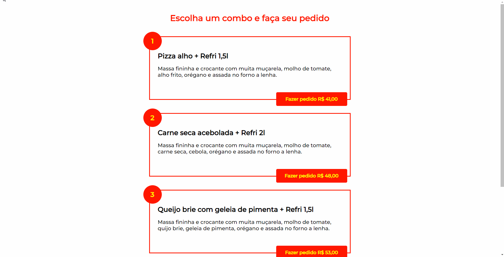

# Objetivo
Acadêmico e didático.

1. Estruturar o projeto em uma pasta separando arquivo-html, arquivo-css e pasta-img.
2. Construir a página inserindo elementos HTML com significado semântico.
3. Estilizar os elementos HTML.

### Fase de construção
Este projeto exigiu conceitos básicos de HTML e CSS. Foi bem interessante ver na prática posicionamento de elementos no css.

### Resultado Final

