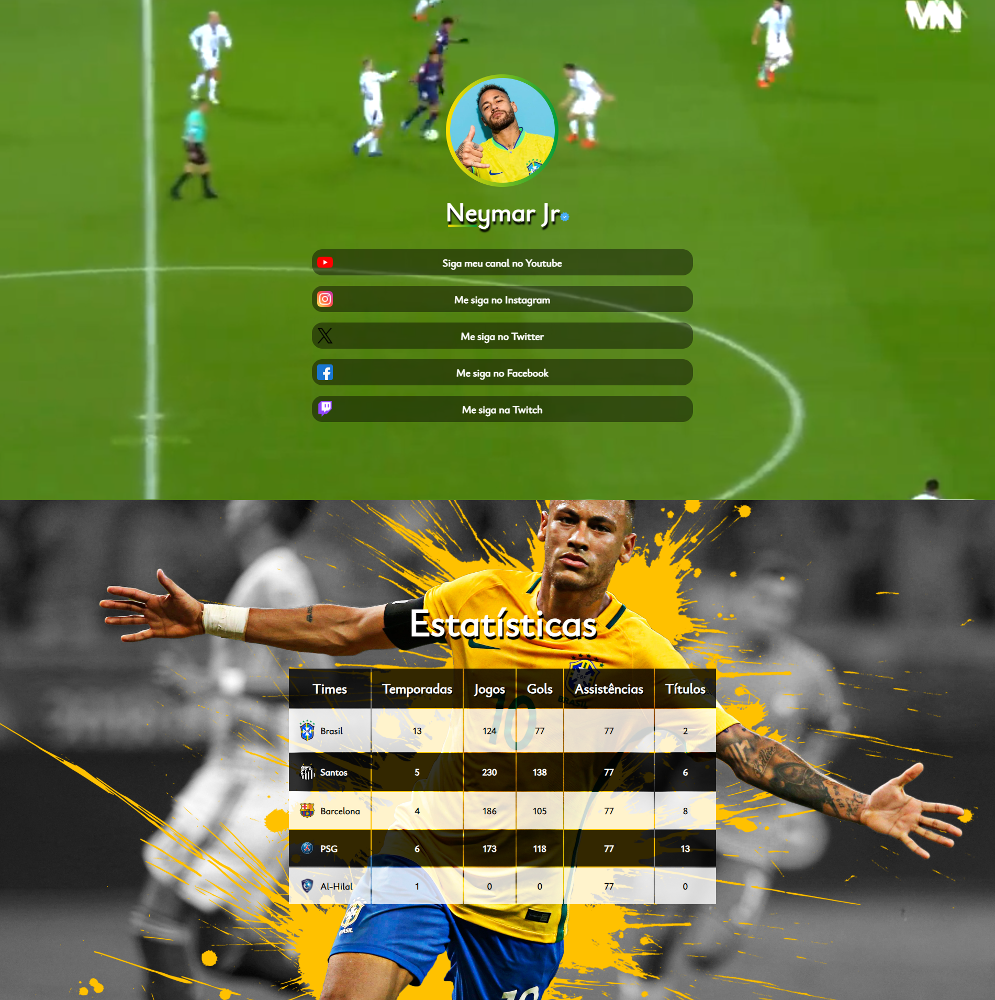

# Objetivo
Acadêmico e didático.

A proposta desse projeto é criar um site utilizando as tecnologias HTML e CSS.

Colocar em prática os seguintes conceitos:
* Pseudo-classes e pseudo-elementos;

* Utilização da tag de video.

### Fase de construção
1. Conhecer a especificação do projeto e seu mini mundo.

* O uso de pseudo-classe e pseudo-elementos para:
    * Auxiliar na criação de uma borda com cor gradiente para a imagem de perfil do "Neymar Jr.";
    * Gerar uma tarja que ficará posicionada abaixo das letras "Ne" do título "Neymar Jr.";
    * Adicionar um ícone de "perfil verificado" ao lado direito do título "Neymar Jr.";
    * Modificar a cor de fundo dos links ao passar o cursor do mouse sobre eles;
    * Criar efeitos CSS personalizados para as linhas e células da tabela, por exemplo:
    As linhas ímpares da tabela terão cor de fundo "preta", enquanto as linhas pares terão cor de fundo "branco".
* Utilização da tag de video para aplicar um vídeo como plano de fundo do site;
* A imagem que será usada como logo da Seção Banner deve ter um formato circular e ter uma borda com uma cor gradiente.
* O título do site deve ter uma "tarja" com cor gradiente, posicionada abaixo das letras "Ne" e uma imagem de "perfil verificado" posicionada à direita do título
* Os links externos do site devem direcionar o usuário para as redes sociais do Neymar Jr.
* A cor de fundo de um link deve ser modificada sempre que um usuário passar o cursor do mouse sobre o link.
* Na Seção Estatísticas, uma imagem deve ser aplicada como plano de fundo e também possuir o efeito Parallax
* O título da Seção Banner e o subtítulo da Seção Estatísticas devem ter um efeito de sombreamento.
* A tabela da Seção Estatísticas terá as informações sobre o Neymar Jr.
* As linhas da tabela devem ter um efeito "zebrado".

> O objetivo do projeto é criar um site para um LinkBio do Neymar Jr.

O site será uma página simples com duas seções:

* Seção Banner;
* Seção Estatísticas.

2. Estruturação da página.
    * **Banner**: Vídeo de plano de fundo; imagem (logo); Um título; link;
    * **Estatísticas**:  imagem de plano de fundo ; subtítulo; tabela

3. Estilização.

### Resultado Final

